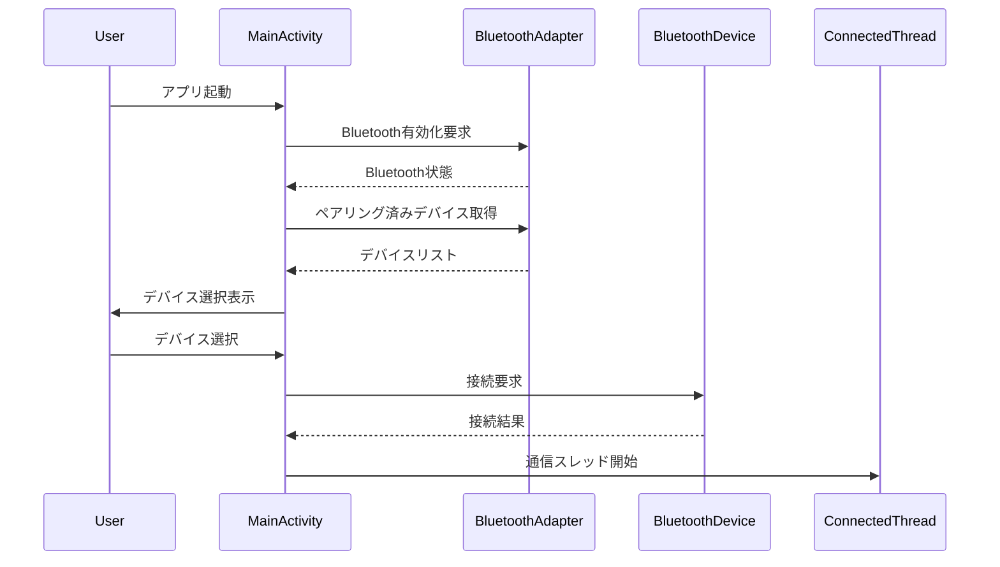

# シーケンス図

## Bluetooth接続シーケンス


## メッセージ送信シーケンス
```mermaid
sequenceDiagram
    participant User
    participant MainActivity
    participant ConnectedThread
    participant RemoteDevice

    User->>MainActivity: メッセージ入力
    MainActivity->>ConnectedThread: メッセージ送信要求
    ConnectedThread->>RemoteDevice: メッセージ送信
    RemoteDevice-->>ConnectedThread: 受信確認
    ConnectedThread->>MainActivity: 送信結果通知
    MainActivity->>User: メッセージ表示